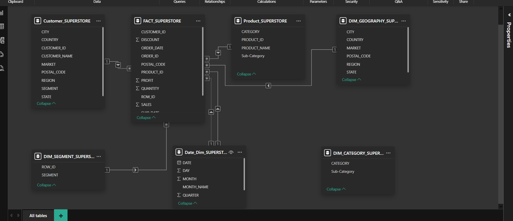
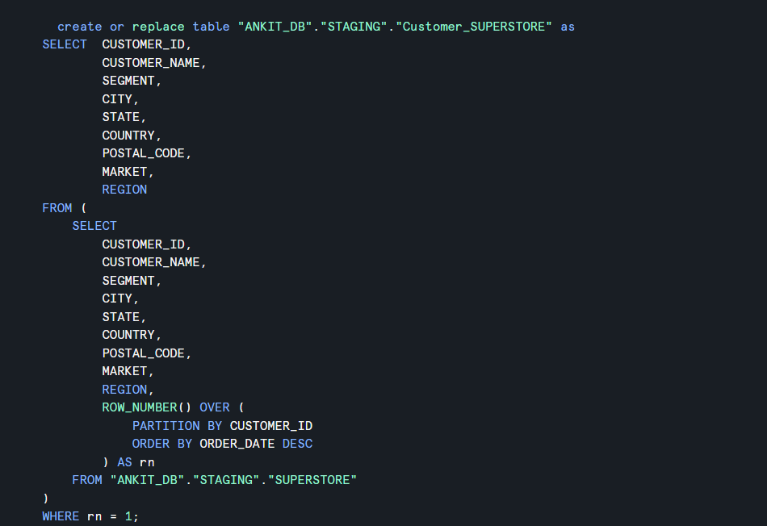
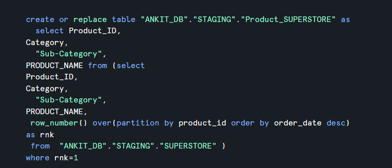
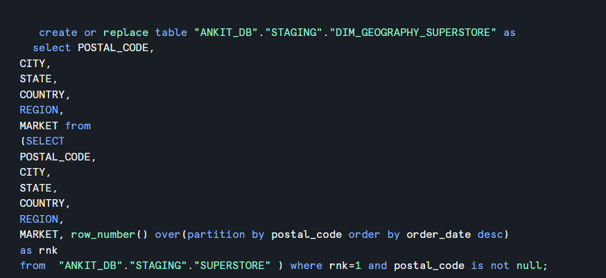

# Snowflake Superstore Datamart

## Business Problem

Raw transactional data is not optimized for analytics, making it difficult to analyze sales across customers, products, and regions.

## Solution

Built a Snowflake datamart using a star schema to enable efficient querying and seamless BI integration.

## Data Model

* Fact Table: FACT_SUPERSTORE
* Dimensions: Customer, Product, Date, Geography, Category and Segment.

## Features

* Star schema modeling
* Optimized fact & dimension tables
* SQL-based transformations
* Ready for Power BI integration

## Tools

Snowflake, SQL, Data Modeling, Power BI

## Data Model Preview  

### Customer Dimension  

### Product Dimension  

### Date Dimension  

### Geography Dimension  

